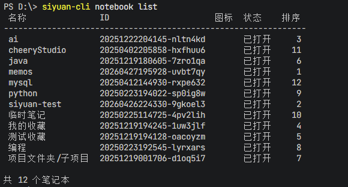
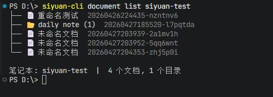
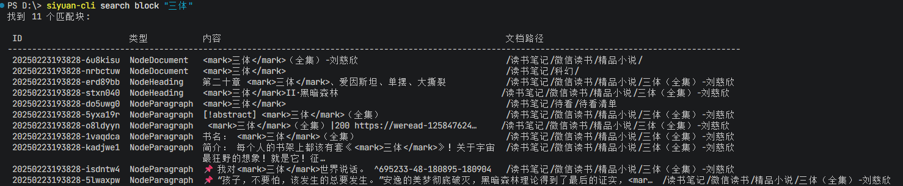
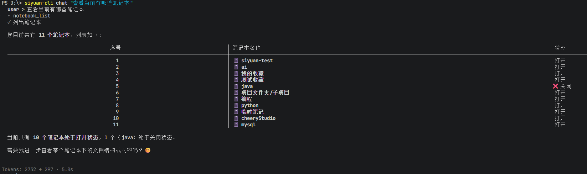
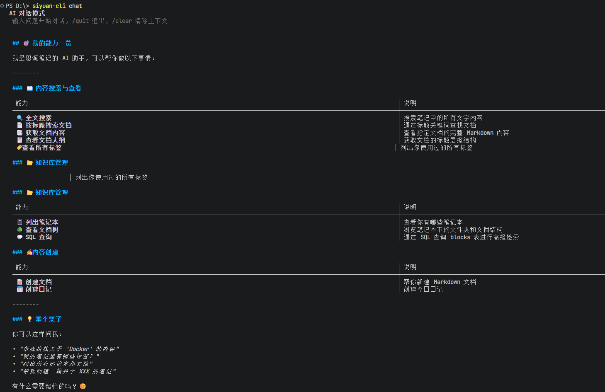

# siyuan-cli

> CLI tool for SiYuan Note — notebook/document/block management, full-text search, SQL query, AI chat, MCP integration, all in the terminal.

[简体中文](README.md) | English


## Features

- **Notebook management** — create, open, close, rename, delete, read/write config
- **Document operations** — list, read, create, rename, delete, move, copy, outline, daily note, history, rollback
- **Block operations** — get block info, get kramdown source, update block content, append block, delete block
- **Full-text search** — search by document title or block content
- **SQL query** — directly query SiYuan blocks table for flexible retrieval
- **Tag management** — list, search, add, remove tags
- **Import & export** — import Markdown/.sy files, export to HTML/DOCX/Markdown/SiYuan format
- **Asset management** — upload assets, view document assets, clean unused assets
- **Sync management** — view sync status, trigger sync
- **AI chat** — tool-calling Agent that automatically retrieves notes and generates answers
- **MCP Server** — stdio mode, lets Claude Desktop, Cherry Studio and other AI clients operate on notes
- **Multiple output formats** — table / JSON, global `--format` switch
- **Multiple AI providers** — OpenAI, Ollama, Zhipu and any OpenAI-compatible API

## Installation

```bash
git clone https://github.com/cicbyte/siyuan-cli.git
cd siyuan-cli
go build -o siyuan-cli .
```

**Requirements:** Go >= 1.24, a SiYuan Note instance (local or remote)

## Quick Start

```bash
siyuan-cli auth login                          # configure connection
siyuan-cli notebook list                        # list notebooks
siyuan-cli search block "keyword"               # full-text search
siyuan-cli chat "search notes about Go"         # AI chat
```

## Commands

| Command                                                                                                                     | Description              |
| --------------------------------------------------------------------------------------------------------------------------- | ------------------------ |
| `auth login` / `logout` / `status`                                                                                          | Connection management    |
| `config list` / `get` / `set`                                                                                               | Configuration management |
| `notebook list` / `create` / `rename` / `delete` / `open` / `close` / `getconf` / `setconf`                                 | Notebook management      |
| `document list` / `get` / `createMd` / `rename` / `delete` / `move` / `copy` / `outline` / `daily` / `history` / `rollback` | Document management      |
| `block get` / `source` / `update` / `append` / `delete`                                                                     | Block operations         |
| `tag list` / `search` / `add` / `remove`                                                                                    | Tag management           |
| `search doc` / `search block`                                                                                               | Search                   |
| `query <sql>`                                                                                                               | SQL query                |
| `export doc` / `export notebook`                                                                                            | Export                   |
| `import md` / `import sy`                                                                                                   | Import                   |
| `asset upload` / `list` / `unused` / `clean`                                                                                | Asset management         |
| `sync status` / `now`                                                                                                       | Sync management          |
| `fav [content]`                                                                                                             | Favorites                |
| `chat [question]`                                                                                                           | AI chat                  |
| `mcp`                                                                                                                       | Start MCP Server         |
| `version`                                                                                                                   | Version info             |

### Notebooks

```bash
siyuan-cli notebook list                        # list notebooks
siyuan-cli notebook create "My Notes"            # create notebook
siyuan-cli notebook rename "old" "new"           # rename
siyuan-cli notebook delete "old" -F              # delete (-F to force)
siyuan-cli notebook open "notebook"              # open
siyuan-cli notebook close "notebook"             # close
siyuan-cli notebook getconf "notebook"           # get config
siyuan-cli notebook setconf "notebook" --sort 1  # set config
```



### Documents

```bash
siyuan-cli document list "My Notes"              # list documents
siyuan-cli document list "My Notes" --path /tech  # specify path
siyuan-cli document get "My Notes" /diary/2024-01-01  # get content
siyuan-cli document createMd "My Notes" --title "New Doc" --content "# Title\nContent"
siyuan-cli document outline "My Notes" /tech     # view outline
siyuan-cli document daily --notebook Diary       # create today's daily note
siyuan-cli document move "nb" /old/path /new/path  # move document
siyuan-cli document copy "nb" /doc/path          # copy document
siyuan-cli document history "nb" /doc --limit 5   # view history
siyuan-cli document rollback "nb" /doc --to <history-path>  # rollback document
```



### Search & Query

```bash
siyuan-cli search doc "AI"                       # search documents by title
siyuan-cli search block "goroutine"               # full-text search blocks
siyuan-cli query "SELECT * FROM blocks WHERE type='d' LIMIT 10"
```



### Blocks & Tags

```bash
siyuan-cli block get 20240101120000-xxx           # get block info
siyuan-cli block source 20240101120000-xxx        # get block kramdown source
siyuan-cli block update <id> --content "new content"  # update block
siyuan-cli block append <doc-id> --content "text"  # append content to document
siyuan-cli block delete <id>                      # delete block
siyuan-cli tag list                               # list tags
siyuan-cli tag search "Go"                        # search tags
siyuan-cli tag add "nb" "/doc/path" --tag "tag"   # add tag
siyuan-cli tag remove "nb" "/doc/path" --tag "tag"  # remove tag
```

### Import & Export

```bash
siyuan-cli export doc "nb" /doc --format html -o output.html
siyuan-cli export notebook "nb" --format md -o ./backup/
siyuan-cli import md ./notes/ --notebook "nb"
siyuan-cli import sy ./backup/ --notebook "nb"
```

### Assets & Sync

```bash
siyuan-cli asset upload ./image.png
siyuan-cli asset list "nb" /doc/path
siyuan-cli asset unused                          # list unused assets
siyuan-cli asset clean -F                        # clean unused assets
siyuan-cli sync status                           # sync status
siyuan-cli sync now                              # sync now
```

### Global Options

```bash
siyuan-cli notebook list --format json           # JSON output
```

## AI Chat

```bash
siyuan-cli chat "question"                       # single-turn
siyuan-cli chat                                  # interactive multi-turn
siyuan-cli chat --non-stream "question"          # non-streaming output
```

The AI Agent uses 10 function tools to retrieve note content (list notebooks, document tree, get document, outline, full-text search, document search, tags, SQL query, create document, create daily note), automatically selects retrieval strategies and generates answers.



Interactive mode supports `/quit` `/exit` `/q` to exit, `/clear` to clear context.



## Configuration

Config file: `~/.cicbyte/siyuan-cli/config/config.yaml` (auto-created on first run)

```yaml
siyuan:
  base_url: "http://127.0.0.1:6806"
  api_token: ""
  timeout: 30
  retry_count: 3
  enabled: false

ai:
  provider: openai
  base_url: "https://open.bigmodel.cn/api/paas/v4/"
  api_key: ""
  model: "GLM-4-Flash-250414"
  max_tokens: 2048
  temperature: 0.8
  timeout: 30

output:
  format: table
```

```bash
siyuan-cli config set ai.api_key "your-api-key"
siyuan-cli config set ai.model "GLM-4-Flash-250414"
siyuan-cli config list
```

## MCP Server

`siyuan-cli mcp` runs an MCP Server in stdio mode with 14 registered tools:

| Tool                 | Description               |
| -------------------- | ------------------------- |
| `notebook_list`      | List all notebooks        |
| `document_list`      | List document tree        |
| `document_get`       | Get document content      |
| `document_outline`   | Get document outline      |
| `block_get`          | Get block info            |
| `block_get_kramdown` | Get block kramdown source |
| `search_fulltext`    | Full-text search          |
| `search_docs`        | Search documents          |
| `tag_list`           | List tags                 |
| `query_sql`          | Execute SQL query         |
| `document_create`    | Create document           |
| `daily_note_create`  | Create daily note         |
| `block_update`       | Update block content      |
| `block_append`       | Append block to document  |

**Claude Desktop:**

```json
{
  "mcpServers": {
    "siyuan": {
      "command": "siyuan-cli",
      "args": ["mcp"]
    }
  }
}
```

**Cherry Studio:** Settings → MCP Servers, command `siyuan-cli`, args `mcp`

## Tech Stack

- Go 1.24
- [Bubbletea](https://github.com/charmbracelet/bubbletea) + [Bubbles](https://github.com/charmbracelet/bubbles) + [Lipgloss](https://github.com/charmbracelet/lipgloss) + [Glamour](https://github.com/charmbracelet/glamour) — TUI
- [Cobra](https://github.com/spf13/cobra) — CLI framework
- [mcp-go](https://github.com/mark3labs/mcp-go) — MCP Server
- [go-openai](https://github.com/sashabaranov/go-openai) — OpenAI-compatible API
- [go-pretty](https://github.com/jedib0t/go-pretty) — Terminal tables
- [Zap](https://github.com/uber-go/zap) — Logging
- [GORM](https://gorm.io/) + SQLite — Data persistence

## License

[MIT](LICENSE) © 2026 cicbyte
